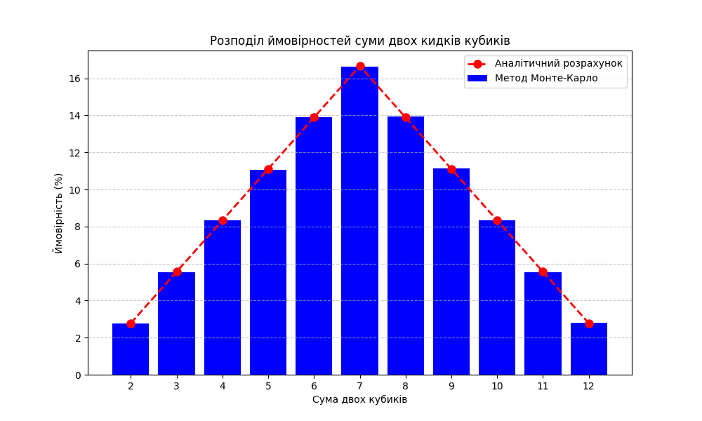

# Порівняння ймовірностей суми кидків двох кубиків

У цьому завданні за допомогою методу Монте-Карло моделюється ситуація, яка полягає у киданні двох гральних кубиків та підрахунку суми випадкових чисел на них.  Отримані результати порівнюються з аналітичним розрахунком ймовірностей для перевірки коректності.

- - -

## Методика

1. Змодельовано 1 000 000 кидків двох кубиків за допомогою генератора випадкових чисел.

2. Для кожного кидка підраховувалась сума випадкових чисел.

3. Підрахована частота (ймовірність) кожної можливої суми.

4. Побудований графік порівняння з аналітичним розрахунком.

- - -

## Результати

- - -

## Висновки

* Результати, отримані за допомогою методу Монте-Карло, дуже близькі до аналітичних розрахунків для всіх можливих сум випадіння очок на двох кубиках.
* Максимальне відхилення у всіх випадках дуже мале.
* Таке невелике відхилення пояснюється тим, що кількість ітерацій моделювання методом Монте-Карло досить велика (1 000 000), що забезпечує високу точність результатів.

Можна сказати, що застосований метод Монте-Карло дає дуже точні оцінки ймовірностей в даній задачі. Результати практично збігаються з аналітичними розрахунками. Таким чином, метод Монте-Карло можна успішно застосовувати для розв'язання подібних задач моделювання випадкових процесів. За достатньої кількості ітерацій він дає результати, які практично не відрізняються від точного аналітичного розв’язку.